## Principes

### Choisir une image

**Banque d'image**

- Une image est choisi par le redacteur de l'article
- Une image est choisie automatiquement depuis une base de donnée suivant le principe “Premier résultat de la requête / J’ai de la chance” 
- Pour illustrer un article, une image est choisie en vue d'être retraité comme matière à un processus génératif :
  + L'image est convertie en Ascii Art
  + L'image est convertie en Ascii Art et seul un fragment est isolé - Abstraction
  + Dégradation la qualité d'image
  + Conversion de l'image en une palette de X couleurs majeurs
  + Collage d'image plus ou moins detaillé
  + Répétition infini d'une infime partie de l'image
  
- Pour illustrer un article, un pictogramme est choisie aléatoirement depuis un répertoire restreint *(image 1)* 

**Aléatoire**

Le caractère aléatoire peut être obtenu :
  - par la definition de valeurs aleatoires (ex. Donne moi une nuage de rouge entre 0 et 100%), pose la question de la valeur d'entrée
  - par la combinaison de motifs visuels issue d'un répertoire restreint

Une image abstraite unique est généré suivant des règles programatiques
Elle est généré une fois pour toute à la rédaction de l'article et est stocké sous forme d'une image ou d'une valeur *(cf. corpus de donnés)*.

 
**Typographie**

- Aucune image n'est choisie, la hiérarchie typographique fait le travail.
- Un ou plusieurs mots sont choisis par le redacteur de l'article afin d'être mis en image. *(image 3 & 4)* 
- Une forme est imbriqué au texte, le texte est imbriqué à la forme ( image 11, image 20)
 
 
**Sans images**

- Le site en tant qu'espace est lui même le visuel principal (image 13, image 15)
- L'image est signifié comme absente. Cette absence est un element signifiant ( image 16)

**Animation**

Valable pour la majorité des cas. L'image est générée par une action (hover, mouvement sourie, scroll, ...) 

***

## Cas concret et exemples visuels

##### Pictogramme
*(image 1)*
Sur la [Chaire Art & Science](http://chaire-arts-sciences.org/category/actions/), chaque article est illustré par un pictogramme abstrait, lié à sa catégorie

##### Dégradation
*(image 2)* 
Sur le site [Low Tech Magazine](https://solar.lowtechmagazine.com/), les images sont volontairement dégradé en Bitmap afin de réduire leurs poids et de soulager le cout énergétique d'une requête serveur (celui-ci fonctionne sur batterie grâce à deux panneaux solaires)  

##### Trame
*(image 3)* 
Exemple mêlant Trame, Typographie et densité. Peut être intéressant d'introduire le mot comme une image.

##### Ascii Art
*(image 4)* 
Clin œil à la nature textuel des images numérique, ce [site](http://mkweb.bcgsc.ca/asciiart/) regorge d'exemple Ascii Art. L'utilisation de cette méthode peut être envisagé au sens plus pragmatique (mettre en échec un copyright ) comme le plus abstrait (Une image "J'ai de la chance" est choisie et devient prétexte à l'isolation d'une suite de caractère )

##### Ascii Art x Motif geometrique
*(image 5)* 
Le Medialab du Prado utilise un système approchant pour son identité. Celui-ci ne fait pas fit des image pour autant.  [Voir le projet en détail](https://www.behance.net/gallery/50727421/Medialab-Prado)

##### Modulaire
*(image 6)* 
En 2006, l'institut Max Plank se dotait d'un logotype modulaire génératif avec un dégradé chromatique particulier. [Plus d'information](https://interaktivegestaltung.net/evolving-logo-2/)

##### Modulaire x dimensions x Motif 
Je (GB) travail actuellement sur un générateur de visuel aléatoire (Motifs, Illustration, Couleurs, Dimmension, placement ) pour une association. Ici un exemple de visuel. L'idée à retenir est que avec 4 couleurs, 8 motifs et une douzaine d'illustrations, on obtient un nombres important de visuels uniques.

##### Abstrait x geometrie x rythmes
*(image 8)* 
Exemple plus abstrait. Ici des jeux avec les formes répétitives de la musiques.

##### Fluidité x Osmose 
*(image 9)* 
Totalement diffèrent, jouer du flou et de l'imbrication de forme coloré pour témoigner du caractère osmotique, transdisciplinaire du Medialab.

##### Cellular automation
*(image 10)* 
Une facon de créer un motif particulier est la methode d'Automate Cellulaire. Le fonctionnement est un peu complexe a expliquer simplement. [Un article Wikipedia](https://fr.wikipedia.org/wiki/Automate_cellulaire) 

##### Croissance
*(image 11)* 
Lignes/cables qui poussent à partir d'un mot  
voir site: [http://gt-zirkon.com/](http://gt-zirkon.com/)

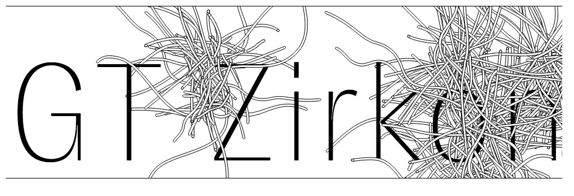

##### Pattern animé
*(image 12)* 
Un pattern est animé, les images peuvent être crées à partir de différentes captures d'écran de ce pattern et selon différents niveaux de zoom. (Edit: Nous pouvons jouer sur la durée, rythme de l'animation ) (Edit : Cela peut faire echo à la composition adaptative du labo en vue d'une multitude de but commun)

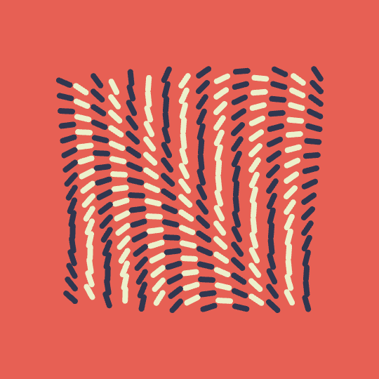

##### Ascii art animé
*(image 13)* 
Animation du ascii art qui vient dégrader certaines parties du site. Permet de mettre en avant la nature binaire du nuémrique et/ou rappelle les jeux de données sur lequel le médialab travaille.  
Voir ce site : [https://ertdfgcvb.xyz/](https://ertdfgcvb.xyz/)

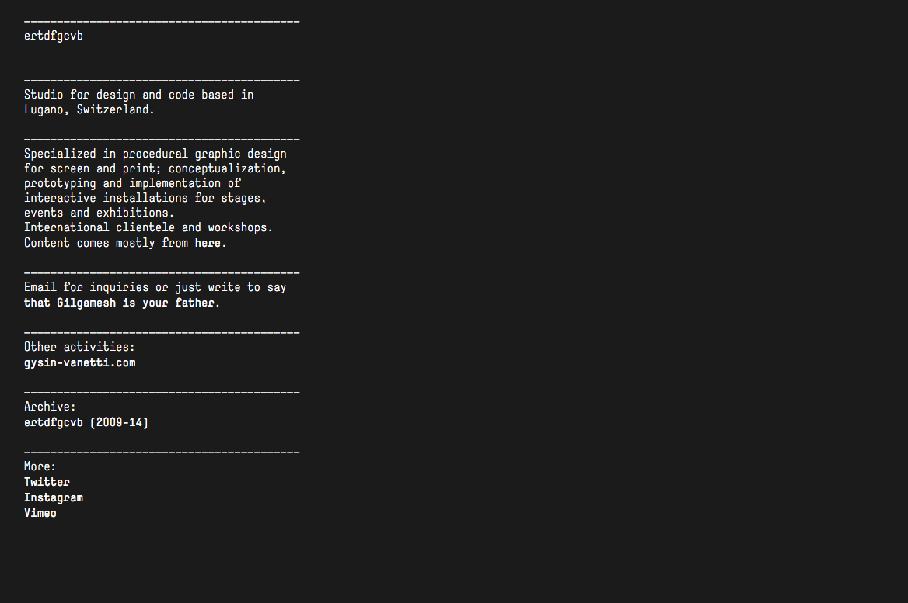
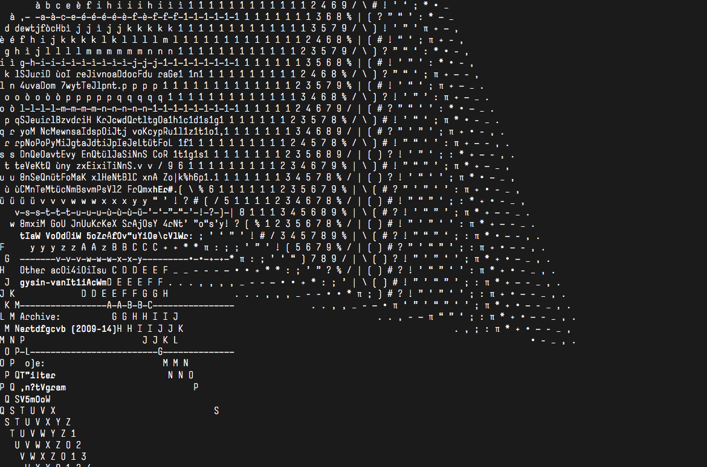

##### Absence d'image signifiée (Border)
*(image 15)* 
Dans cette exemple d'identité, l'absence d'iamge est signifiée par un pttern de rayure.

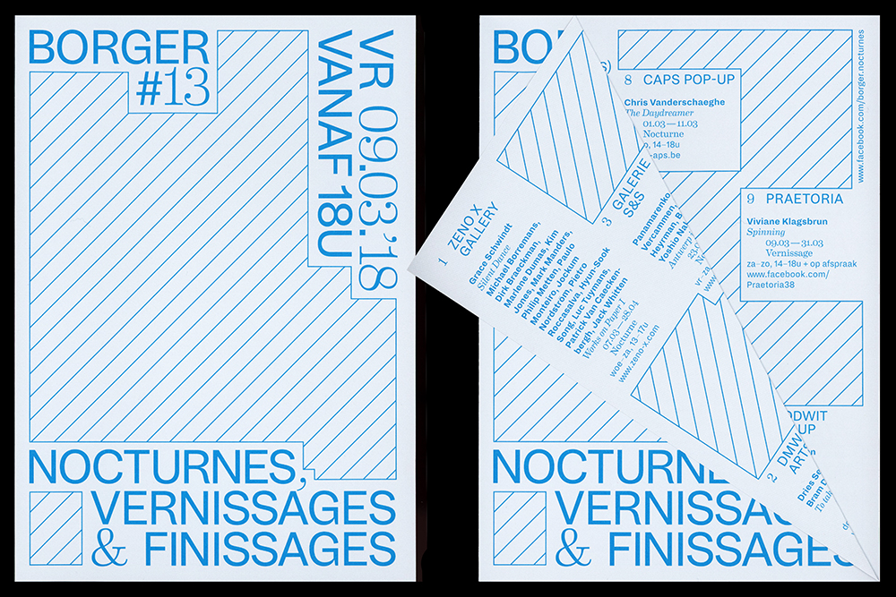

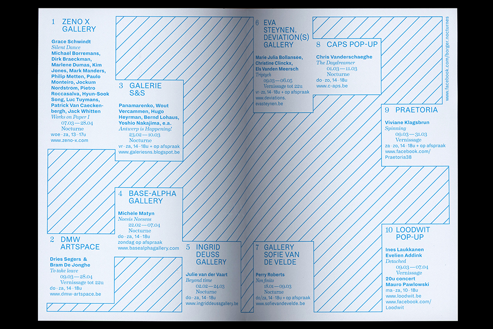

##### Absence d'image signifiée (Emma Geslot)
*(image 16)* 
Même absence d'image signifiée mais sur un site et avec une symbolique empruntée des logiciels de PAO.  
Site: [http://emmageslot.com/](http://emmageslot.com/)

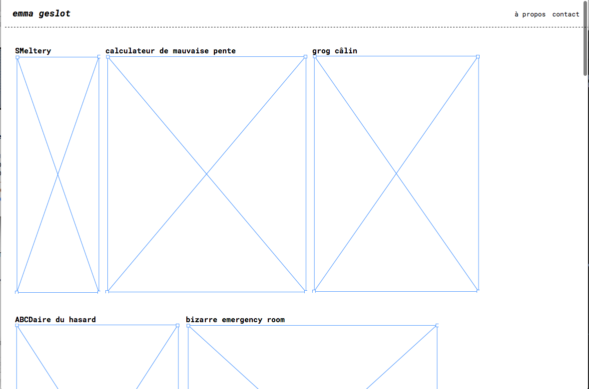

##### Ligne/courbe dont les points sont générés aléatoirement 
*(image 17)* 
Mélangée à du texte  
Voir bandeau de ce site: [https://nucleartests.org/dominic](https://nucleartests.org/dominic)

##### Forme géométrique simple

Utilisation d'une forme gééométrique simple avec laquelle on joue (pattern, mélange avec du texte, animation).  
Sur ce site, un rond: [http://tecprize.org/](http://tecprize.org/)    
Sur les cartes de visites suivantes, des rectangles:  
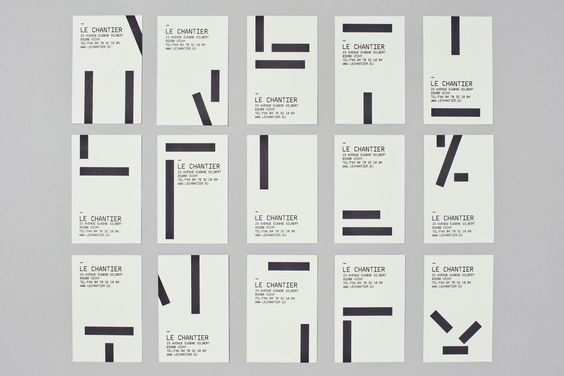

##### Patterns générés en CSS

Tuto: [https://css-doodle.com/](https://css-doodle.com/)  
Possibilités: [https://twitter.com/yuanchuan23/status/1057447267269992449](https://twitter.com/yuanchuan23/status/1057447267269992449)

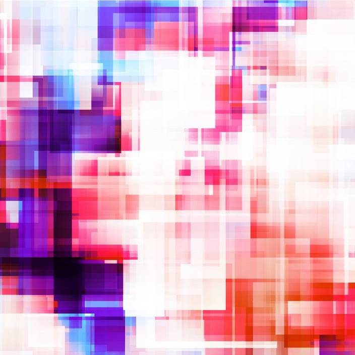  
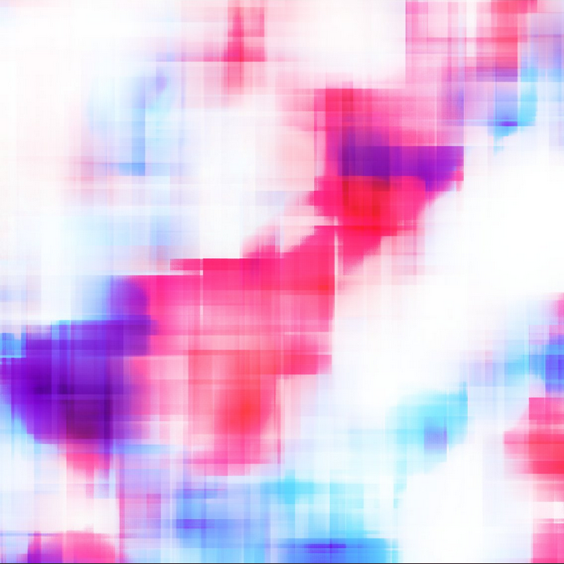

##### Texte x liquidité

Des formes liquides viennent cacher/révéler un court texte (note: ces formes peuvent être en mouvement)

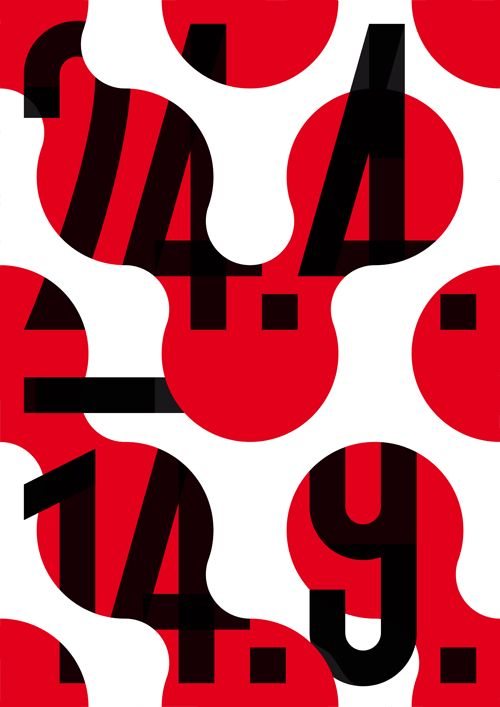
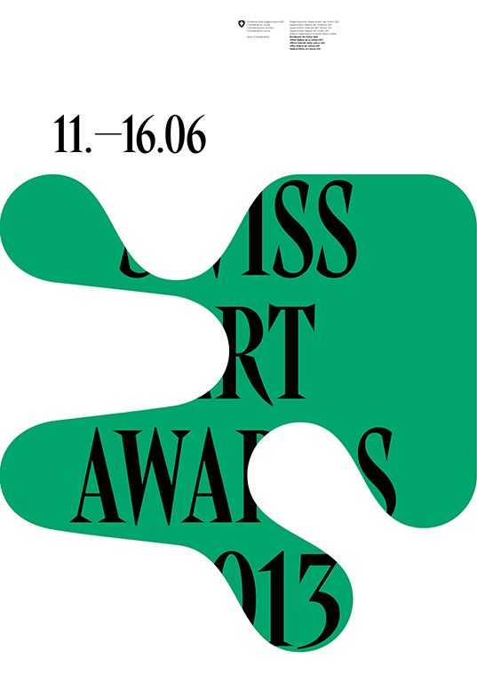

